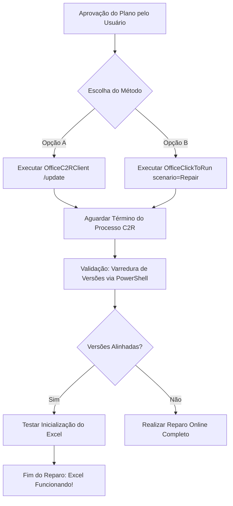

# Plano de Diagnóstico e Reparo: Correção de Incompatibilidade de Versões do Office Click-to-Run

> [!NOTE]
> Este plano foi elaborado para resolver em definitivo o problema de inicialização do Microsoft Excel que exibe o erro: *"O sistema operacional não está configurado para executar este aplicativo"* seguido pela solicitação de Modo de Segurança, após a limpeza dos redirecionamentos do CCleaner (IFEO).

---

## 1. Contexto e Histórico

Recentemente, identificamos e removemos com sucesso os bloqueios e redirecionamentos abusivos de IFEO (Image File Execution Options) criados pelo CCleaner que impediam o Word e o Excel de iniciarem (retornando erro `Exit Code 1060`).

Embora o Word tenha voltado a funcionar normalmente, o **Excel** passou a apresentar um comportamento secundário de falha com a seguinte mensagem de erro do Windows:
> **"O sistema operacional não está configurado para executar este aplicativo."**

Após esse aviso, o sistema sugere iniciar o Excel em Modo de Segurança, o que também falha ou repete o ciclo de erro.

---

## 2. Análise da Causa Raiz (Root Cause)

Realizamos uma varredura profunda dos componentes instalados do Microsoft Office 16 e detectamos uma **incompatibilidade crítica de versões (mismatch)** nos binários do motor de execução *Click-to-Run* (C2R). 

### Status Atual dos Componentes Detectados:
| Componente do Office | Versão Instalada | Status |
| :--- | :---: | :---: |
| **Microsoft Office LTSC Professional Plus 2024 - en-us** | `16.0.17932.20790` | Atualizado (Sincronizado) |
| **Microsoft Office LTSC Professional Plus 2024 - pt-br** | `16.0.17932.20790` | Atualizado (Sincronizado) |
| **Office 16 Click-to-Run Licensing Component** | `16.0.17932.20790` | Atualizado (Sincronizado) |
| **Office 16 Click-to-Run Extensibility Component** | `16.0.17928.20216` | **DESATUALIZADO (Fora de Sincronia!)** |
| **Office 16 Click-to-Run Localization Component** | `16.0.17928.20216` | **DESATUALIZADO (Fora de Sincronia!)** |

### Por que isso afeta o Excel?
Quando o Microsoft Excel inicia, ele valida as licenças locais e carrega extensões nativas usando as DLLs e componentes de extensibilidade/localização do *Click-to-Run*. Como o pacote LTSC Professional Plus principal está na build `.20790` e os componentes de extensibilidade e de idioma regional estão na build anterior `.20216`, ocorre uma quebra de chamadas de API internas (COM/DLL) e de assinaturas de licença. 

O Windows interpreta essa falha de integridade do subsistema de licenciamento Click-to-Run como uma violação de ambiente de execução, gerando o erro genérico do sistema operacional.

Tanto `OfficeClickToRun.exe` quanto `OfficeC2RClient.exe` estão funcionais na pasta de origem:
`C:\Program Files\Common Files\microsoft shared\ClickToRun\`

---

## 3. Solução Proposta (Opções de Reparo Automático)

Para alinhar as versões das extensões e componentes regionais de forma segura, propomos duas alternativas utilizando as ferramentas oficiais integradas da própria Microsoft.

### Opção A: Atualização Direta via OfficeC2RClient (Recomendada)
Força o agente Click-to-Run a consultar os servidores da Microsoft (ou servidor local de distribuição LTSC) e baixar os arquivos da build `.20790` para os componentes defasados.

* **Comando:**
  ```powershell
  "C:\Program Files\Common Files\microsoft shared\ClickToRun\OfficeC2RClient.exe" /update user
  ```
* **Funcionamento:** O processo é executado de forma silenciosa ou em segundo plano pelo próprio atualizador do Office.
* **Vantagens:** Extremamente rápido e não-intrusivo.

---

### Opção B: Reparo Integrado do Office Click-to-Run (Alternativa de Segurança)
Abre a interface do assistente de instalação do Click-to-Run em modo de reparo. Permite escolher entre o **Reparo Rápido** (corrige arquivos corrompidos locais) e o **Reparo Online** (rebaixa e reinstala os pacotes garantindo compatibilidade absoluta).

* **Comando:**
  ```powershell
  "C:\Program Files\Common Files\microsoft shared\ClickToRun\OfficeClickToRun.exe" scenario=Repair platform=x64 culture=pt-br
  ```
* **Funcionamento:** Exibe um assistente gráfico oficial da Microsoft na tela do usuário.
* **Vantagens:** Extremamente robusto; resolve qualquer corrupção estrutural nos arquivos de idiomas ou de licenciamento local.

---

## 4. Plano de Execução e Validação

Uma vez aprovada a execução, seguiremos estes passos estruturados:



### Passos de Verificação Manual:
1. **Verificação de Consistência:** Executar o script de listagem de componentes instalado para atestar se o `Extensibility Component` e `Localization Component` subiram para a versão `16.0.17932.20790`.
2. **Teste de Execução:** Abrir o Excel normalmente (sem Modo de Segurança) e confirmar se a planilha principal é aberta com sucesso.
3. **Teste Cruzado:** Abrir o Word para certificar-se de que a suite continua funcionando em perfeita harmonia.

---

> [!IMPORTANT]
> **Status:** AGUARDANDO APROVAÇÃO DO USUÁRIO.  
> Por favor, analise as opções apresentadas e nos dê luz verde para iniciarmos o reparo conforme sua preferência de método (Opção A ou Opção B).
