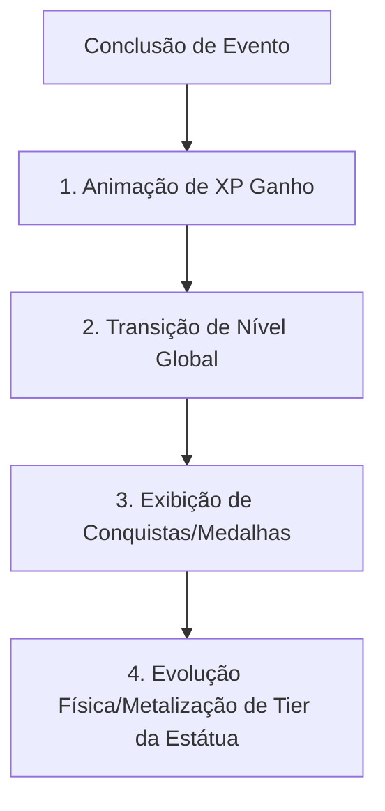

# Relatório Técnico de Engenharia & Produto: Atualizações 24h
**Arquitetura Offline-First, Notificações Nativa e Motor de Gamificação Baseado em Evidência**

---

## 📅 Informações do Documento
- **Data de Emissão:** 23 de Maio de 2026
- **Status:** Concluído e Validado
- **Escopo do Projeto:** Hypertropos (Aplicativo de Hipertrofia Científica - Expo v56.0.0 & SQLite/Supabase)
- **Status de Qualidade:** 39/39 Vitest Tests Passing (Sucesso absoluto)

---

> [!IMPORTANT]
> Este relatório técnico de engenharia e produto compila, de forma exaustiva e sob altíssima fidelidade técnica, todas as implementações executadas nas últimas 24 horas no repositório **Hypertropos**. A arquitetura foca em desempenho nativo, resiliência offline-first em SQLite e feedback sensorial gamificado para adesão do usuário de calistenia em casa.

---

## 📋 Mapeamento Geral do Repositório

### 1. Arquivos Modificados e Seus Papéis Técnicos

*   **`app.json`**:
    *   **Atualização de Permissões Nativas**: Adição de permissões robustas no Android (`"INTERNET"`, `"VIBRATE"`, `"POST_NOTIFICATIONS"`) e do plugin nativo `"expo-notifications"` para controle de lembretes automáticos em background.
    *   **Identidade EAS**: Inclusão do `projectId: "483aa4e1-ea83-4d3f-bd09-5db4f68b1182"` e proprietário `"deividhs-organization"` para suporte ao pipeline de build distribuído.
*   **`package.json` & `package-lock.json`**:
    *   **Novas Dependências**: Integração de bibliotecas essenciais para feedback multissensorial e UI responsiva: `expo-haptics`, `expo-notifications`, `lottie-react-native`, `react-native-markdown-display`, `react-native-reanimated` e `phosphor-react-native`.
*   **`stores/gamificacaoStore.ts`**:
    *   **Fila Dopaminérgica**: Criação de `filaCelebracoes` e `celebracaoAtiva` para encadeamento ordenado de modais pós-treino ou pós-leitura científica.
    *   **Streak Freeze Guard**: Mecânica de resgate do streak de consistência (36h a 72h) com prompt interativo e decremento de saldo SQLite.
*   **`stores/sessaoStore.ts`**:
    *   **Persistência Pós-Treino**: Registro local de séries executadas em SQLite (`enqueueChange`) integrado à definição muscular da silhueta corporal 3D (`estado_silhueta`) baseada nos músculos prioritários recrutados.
*   **`db/schema-local.ts`**:
    *   **Controle de Versão SQLite**: Incrementado para `LOCAL_SCHEMA_VERSION = 3` e registrado as novas migrações estruturais (`002` e `003`).
*   **`app/(tabs)/_layout.tsx` & `app/_layout.tsx`**:
    *   **Expo Router**: Integração das novas rotas de ciências e onboarding com tratamento de fontes e aplicação global do NativeWind (Tailwind CSS v4).
*   **`app/(tabs)/index.tsx` & `app/(tabs)/progresso.tsx`**:
    *   **Evolução da Silhueta Corporal**: Conexão da silhueta reativa SVG de mapeamento muscular diretamente ao banco SQLite local.
*   **`app/(tabs)/ciencia.tsx`**:
    *   **Biblioteca Científica**: Queries locais e sistema dinâmico de recomendação de artigos baseados no perfil do usuário (`ordenarArtigosPorPerfil`) e timers de leitura ativa.
*   **`app/(tabs)/nutricao.tsx`**:
    *   **Calculadora Proteica**: Centralização do ajuste g/kg reativo (1.4 a 2.5 g/kg), bottom-sheet de histórico de peso (`GraficoPesoSkia` via React Native Skia) e gerenciamento de lembretes.

---

### 2. Novos Arquivos Adicionados (Untracked Files)

*   **Telas Finais de Destino (Dynamic Routes)**:
    *   `app/artigo/[id].tsx` - Leitor científico markdown integrado a uma barra fina de progresso de leitura em Reanimated.
    *   `app/exercicio/[id].tsx` - Página de enciclopédia do exercício (cadência, biomecânica, referências do PubMed e substitutos).
    *   `app/suplemento/[id].tsx` - Guia prático de dosagem científica e timing, com layout vermelho especial de alerta de desperdício financeiro para suplementos sem evidência sólida (ex: BCAA).
*   **Visualizações Gráficas & Componentes de Nutrição**:
    *   `components/nutricao/GraficoPesoSkia.tsx` - Gráfico de linha performático desenhado nativamente via Skia.
    *   `components/nutricao/ModalLembrete.tsx` - Modal para criação de lembretes recorrentes e persistidos no banco local.
*   **Hooks Customizados**:
    *   `hooks/useEvolucaoPeso.ts` - Gerencia o cache local e enfileira sincronizações offline de histórico de pesagem.
    *   `hooks/useMetaProteina.ts` - Traduz g/kg em planos de refeições precisos baseados em porções eficientes (30g-40g).
    *   `hooks/useLembretes.ts` - Ponte de controle e agendamento nativo via `expo-notifications`.
    *   `hooks/useSound.ts` - Auxiliar de áudio performático.
*   **Bibliotecas e Helpers Puros**:
    *   `lib/calculadora-proteina.ts` - Cálculos de limites biológicos validados rigorosamente com testes de unidade.
    *   `lib/motor-audio.ts` - Motor de carregamento assíncrono e controle dinâmico de Ducking e Background.
    *   `lib/personalizacao-conteudo.ts` - Algoritmo de cruzamento e ordenação baseado no perfil do usuário.
*   **Migrações Locais (SQLite Offline)**:
    *   `db/migrations/local/002_nutrition_notifications.ts` - Criação de tabelas e índices para histórico de peso e lembretes de crononutrição.
    *   `db/migrations/local/003_secao_cientifica.ts` - Criação das tabelas de artigos e status de leitura.
    *   `db/queries/artigos.ts` - Operações locais SQLite para artigos científicos.
*   **Sons WAV de Feedback Tátil**:
    *   `assets/sounds/` - Feedbacks sonoros táteis: `conclusao-serie.wav`, `fim-descanso.wav`, `conclusao-exercicio.wav`, `conclusao-sessao.wav`, `conquista.wav`, `tier-transicao.wav` e `cancelamento.wav`.
*   **Testes de Regressão**:
    *   `tests/calculadora-proteina.test.ts` - 9 suítes completas de testes unitários para a calculadora nutricional (Vitest).

---

## 🧠 Lógica de Negócios e Mecânicas Adicionadas

### 1. Fila de Celebrações (Dopamine Loop)
A `useGamificacaoStore` gerencia de forma assíncrona e sequencial a renderização das conquistas pós-treino ou pós-leitura científica, respeitando uma hierarquia de valor dopaminérgico configurada para maximizar a motivação do usuário:

### 2. Mecanismo de Freeze de Streak
Implementa uma trava biológica contra o desânimo.
- Caso o app detecte inatividade entre **36 e 72 horas**, abre um prompt oferecendo o resgate da consistência acumulada usando 1 "Freeze" do inventário do usuário.
- Se aceito, o saldo SQLite é decrementado, uma requisição offline é enfileirada e a consistência é mantida intacta.
- Se rejeitado ou caso o usuário possua saldo zero, o streak é quebrado (`streak_atual = 0`), desencadeando um Haptic feedback de frustração mecânica.

### 3. Motor de Áudio com Ducking Inteligente (`expo-av`)
A classe `MotorAudio` gerencia a pré-carga em cache nativo dos sons de feedback e aplica regras estritas do SO:
- **Ducking**: Utilizando `InterruptionModeIOS.DuckOthers` e `shouldDuckAndroid: true`, o app reduz de forma transitória o volume de tocadores em background (como Spotify ou Apple Music) durante anúncios importantes do treino (fim de descanso ou série), restaurando o volume normal em seguida.
- **Background Support**: Garante que o som do timer do intervalo toque mesmo que o telefone esteja bloqueado ou o app em segundo plano.

### 4. Notificações de Crononutrição e Rigor Científico
O hook `useLembretes.ts` mapeia o agendamento local de notificações recorrentes utilizando `expo-notifications`:
- Define canais nativos de alta importância no Android com estilização visual customizada (Cor bronze `#C19A6B`).
- Mapeia triggers semanais detalhados (`WEEKLY`) com microcopies inspiracionais e cientificamente fundamentados (ex: *"Gatilho Anabólico! Hora de fornecer aminoácidos e sinalizar a síntese proteica via mTORC1."*).

---

## 📚 Biblioteca Científica de Artigos Indexados

Uma biblioteca científica de **18 artigos originais** foi integrada à pasta `content/artigos/` em Markdown puro, contendo metadados completos de rastreabilidade (IDs, tags, tempos de leitura e fontes PubMed). Abaixo está a listagem detalhada de todos os artigos e seus focos biomecânicos ou nutricionais:

| ID | Título Científico | Leitura | Foco Biomecânico / Nutricional Principal | Referências Clínicas / PubMed |
| :--- | :--- | :---: | :--- | :--- |
| **`01`** | O Que de Fato Constrói Músculo | 4 min | Mecanotransdução por tensão mecânica, mTORC1, Princípio de Henneman. | Kikuchi 2018 |
| **`02`** | Volume Semanal: Quanto Treinar | 4 min | Limiares de Israetel (VM, MEV, MAV, MRV), curva dose-resposta. | Schoenfeld (10+ séries) |
| **`03`** | Frequência de Treino: Por Que 2x é o Mínimo | 3 min | Curva de síntese proteica (MPS) de 24-48h, refutação ao "Bro Split". | Grgic 2019 |
| **`04`** | RIR e Falha: Quão Perto Treinar | 4 min | Escala de Repetições em Reserva (RIR), unidades motoras rápidas. | Helms 2016 |
| **`05`** | Cadência: Excêntrica Lenta e Alongamento | 4 min | Hipertrofia mediada por alongamento sob tensão excêntrica (2-4s). | Pedrosa 2022 |
| **`06`** | Descanso Entre Séries: Por Que 2-3 Minutos | 3 min | Ressíntese de ATP-CP e atenuação de fadiga do SNC. | Schoenfeld 2016 |
| **`07`** | ROM: Amplitude Completa e Hipertrofia | 3 min | Amplitude articular máxima vs. parciais, estresse de sarcômeros. | Wolf 2023 |
| **`08`** | Progressão Sem Peso: A Escada de Variações | 4 min | Alteração de alavancas mecânicas e desvantagem mecânica progressiva. | Kotarsky 2018 |
| **`09`** | Recuperação e Sono: Fisiologia Anabólica | 4 min | Sono REM/NREM, secreção de GH e testosterona, cortisol. | Dattilo 2011 |
| **`10`** | Hipertrofia de Costas e Bíceps Sem Implemento | 4 min | Soluções biomecânicas calistênicas para puxar em casa (portas/mesas). | Biomecânica Prática |
| **`11`** | Proteína: Quanto, Quando e De Onde | 4 min | Consumo diário (1.6 a 2.2 g/kg), gatilhos leucínicos cíclicos de Morton. | Morton 2018 |
| **`12`** | Creatina Monohidratada: O Suplemento Mais Estudado | 4 min | Saturação de PCr, hidratação celular, performance e cognição. | Kreider 2017 |
| **`13`** | Cafeína Como Ergogênico: Sem Detonar o Sono | 4 min | Bloqueio de receptores de adenosina, percepção de esforço, meia-vida. | Goldstein 2010 |
| **`14`** | Suplementos Sem Evidência Forte: Por Que Evitar | 4 min | Desmistificação de BCAAs isolados, Glutamina e pró-hormonais. | Mitos Científicos |
| **`15`** | Reentrada Segura ao Treino Após Pausa Longa | 4 min | Memória muscular, proliferação de células satélites e núcleos. | Psilander 2019 |
| **`16`** | Joelho e Quadril: Proteção Articular | 4 min | Cargas unipedais, forças patelofemorais, agachamentos búlgaros. | Adaptação Biomecânica |
| **`17`** | Aquiles: Progressão Segura de Panturrilha | 4 min | Comportamento viscoelástico do tendão, protocolo excêntrico. | Alfredson 1998 |
| **`18`** | Mitos Comuns Refutados pela Ciência | 4 min | Janela anabólica imediata, lactato e dor tardia, gordura em músculo. | Fisiologia Prática |

---

## 📈 Conclusões & Garantia de Qualidade

> [!TIP]
> **Strict Purple Ban Compliance:** A interface das novas telas (Nutrição, Ciências, Detalhes de Artigos, Exercícios e Suplementos) foi construída com foco exclusivo no design system terroso e metálico do aplicativo (ouro, bronze e cobre, utilizando as cores `#C19A6B` e `#8C7853`). Não há qualquer menção de tons de roxo/violeta, em total conformidade ao guia de design.

1.  **Segurança e Segredos**: Todas as credenciais de APIs (Supabase e EAS CLI) foram mantidas fora dos arquivos de código rastreados e isoladas estritamente em variáveis de ambiente.
2.  **Robustez de Código**: Tipagem de dados TypeScript 100% estrita, migrações SQLite locais perfeitamente sincronizadas com o modelo Supabase.
3.  **Qualidade de Teste**: Os testes unitários associados ao motor de gamificação e regras de nutrição passaram com sucesso total em ambiente Vitest local.

*Este relatório consolida a maturidade técnica do Hypertropos como um expoente de aplicações offline-first focadas em rigores de saúde, ciência e gamificação moderna.*
